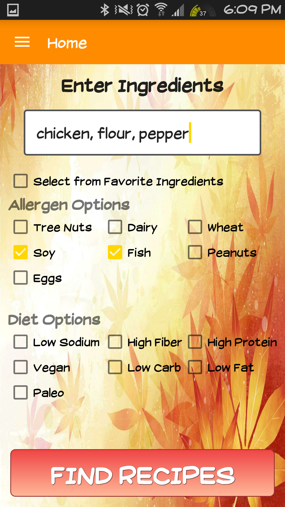
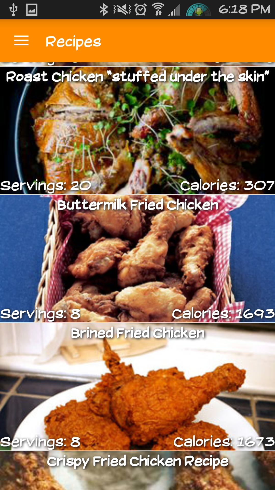
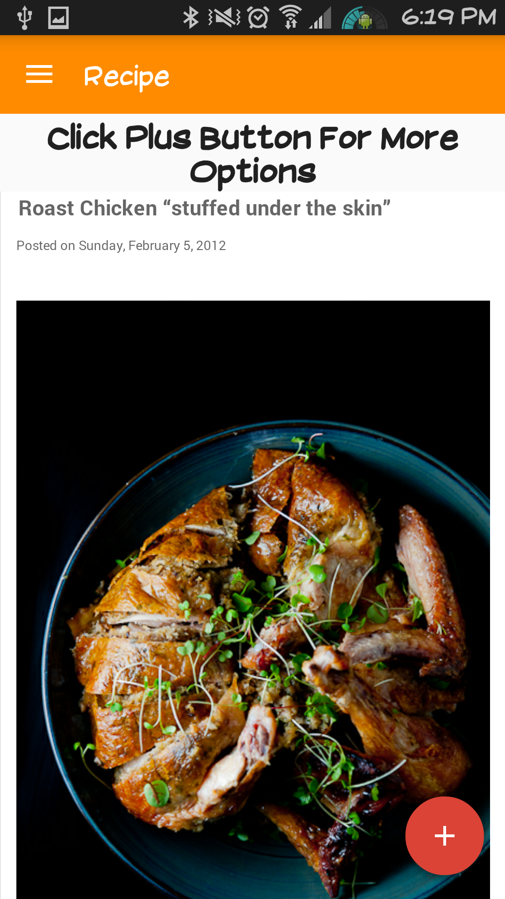
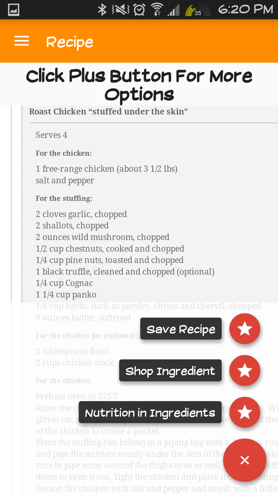

<b>Whisk ~</b> Recipes by Ingredients Android Application (Java, Android Studios)

  
  
  
  

<b>Objective:</b>

Create an android application that provides the end user the ability to search through thousands of recipes by providing ingredients or recipe names. Recipes can be filtered by allergens and a multitude of diets: such as low fat, low calories, and many more. Provide ability to save recipes for later and find nearest grocery stores with available ingredients. Ease of use and clean implementation.

<b>Collaborated with 6 members to provide an simple and intuitive UI for ease of use at any age.</b>

